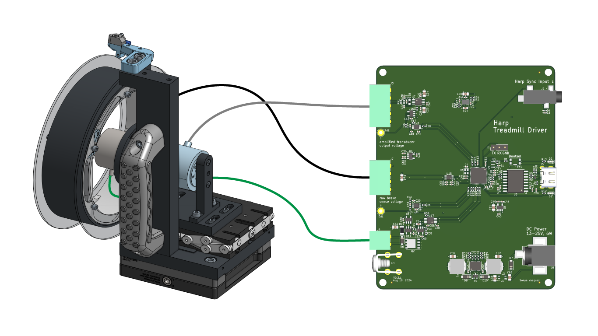

A Harp Device for controlling an instrumented variable-friction mouse treadmill

> [!NOTE]
> This repository contains design files for the electronics assembly. For the mechanical assembly, design files, and bill-of-materials, see the [OnShape project](https://cad.onshape.com/documents/579ff6de692121d8b6a45604/v/23e1e086e9eb645d096dac80/e/a0ad881c32324c0acf8e15df).

## Features
* linear (no switching!) current control of 12V magnetic brake, Placid Industries B5ZD, [datasheet](https://placidindustries.com/d/?h=a03be4b).
* reads measurements from an [RTS-10 torque transducer](https://www.transducertechniques.com/rts-torque-sensor.aspx#)
* wheatstone bridge input for torque transducer
* quadrature encoder input for position/speed measurements
* Harp-protocol compliant over full-speed USB
* accepts Harp time synchronization input.
* reverse-polarity protected power supply.

## Register Map
[List of Registers](./firmware/docs/register_map.csv)

## Credits
This board design was created in partnership with the team at [Second Order Effects](https://soeffects.com/).
